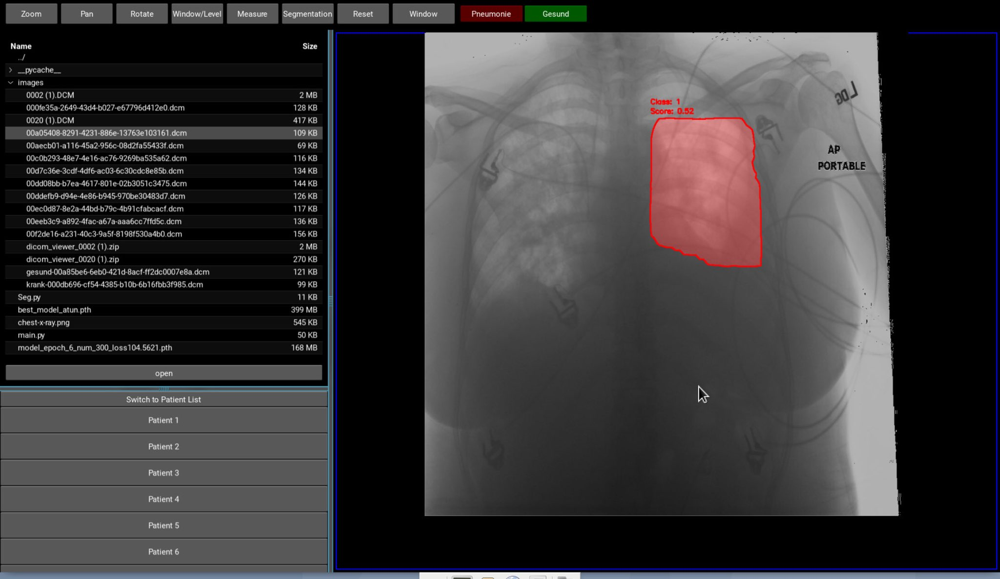

 # PneuNet: Pneumonia Detection mit KI

---

## Inhaltsverzeichnis
- [Projektübersicht](#projektübersicht)
- [Motivation & Relevanz](#motivation--relevanz)
- [Technische Spezifikationen](#technische-spezifikationen)
- [Anwendungsfelder](#anwendungsfelder)
- [Daten & Vorverarbeitung](#daten--vorverarbeitung)
- [Methodik & Evaluation](#methodik--evaluation)
- [DICOM Viewer Integration](#dicom-viewer-integration)
- [Installation & Nutzung](#installation--nutzung)
- [Herausforderungen & Schwachstellen](#herausforderungen-schwachstellen)
- [Zukunftsausblick](#zukunftsausblick)
- [Projektstruktur](#projektstruktur)
- [Mitwirkung & Lizenz](#mitwirkung--lizenz)
- [Kontakt](#kontakt)

---

## 📌 Projektübersicht

**Titel:** Pneumonia Detection mithilfe von Convolutional Neural Networks  

Unser Ziel ist es, Ärzte bei der Diagnose von Pneumonie zu unterstützen, Fehlentscheidungen zu vermeiden und die Genauigkeit der Erkennung zu verbessern. Durch die Optimierung von Netzarchitekturen und Lernparametern streben wir eine höhere Genauigkeit als die durchschnittlichen 76 % der menschlichen Diagnostik an.

---
## Motivation & Relevanz
###  Warum ist dieses Projekt wichtig?
Jedes Jahr erkranken Millionen Menschen weltweit an Pneumonie. 2022 verstarben allein in Deutschland 16.155 Menschen an dieser Krankheit. Sie ist die häufigste tödliche Krankenhausinfektion und eine der führenden Todesursachen in unterversorgten Regionen. Eine frühzeitige Erkennung kann lebensrettend sein. Unsere Forschung zielt daher darauf ab:

- **Fehlerminimierung:** Reduktion der diagnostischen Fehlerquote, da die manuelle Diagnose oft nur ca. 76 % Genauigkeit erreicht.
- **Effizienzsteigerung:** Beschleunigung der Diagnoseprozesse in zeitkritischen klinischen Umgebungen.
- **Transparenz:** Bereitstellung erklärbarer KI-Ergebnisse zur Unterstützung des ärztlichen Entscheidungsprozesses.

### Wer kann die Ergebnisse nutzen?
Unsere Forschungsergebnisse bieten nicht nur Ärzten und Radiologen eine fortschrittliche Diagnoselösung, sondern ermöglichen auch den Einsatz in Gebieten mit begrenztem Personal. So kann die Software beispielsweise in ländlichen Regionen, in Pflegeheimen, in primärärztlichen Einrichtungen oder bei telemedizinischen Anwendungen zur schnellen und präzisen Diagnosestellung eingesetzt werden. Dies fördert die frühzeitige Erkennung von Pneumonie, minimiert diagnostische Fehler und trägt maßgeblich zu verbesserten Behandlungsergebnissen bei – ein entscheidender Mehrwert, insbesondere in ressourcenknappen Umgebungen und Notfallszenarien.

---

## Technische Spezifikationen
- **Höchste Genauigkeit:** Über 90 % diagnostische Präzision.
- **Modulare Architektur:** Klare Trennung der Module für Klassifikation, Segmentierung und Objekterkennung.
- **Erklärbare KI:** Einsatz fortschrittlicher Techniken wie Mask R-CNN und Class Activation Mapping (CAM) zur transparenten Darstellung der Entscheidungsgrundlagen.
- **DICOM Viewer Integration:** Intuitive Benutzeroberfläche zur direkten Visualisierung und Interaktion mit den Analyseergebnissen.

---

## Daten und Vorverarbeitung
### Verwendete Datensätze
- **NIH-Chest-Xray Dataset:** 30.000 Röntgenbilder, kategorisiert in "erkrankt" und "gesund".
- **Kaggle Chest XRay Dataset:** 6.000 Röntgenbilder, unterteilt in "gesund", "bakterielle Pneumonie" und "virale Pneumonie".
- **Lungen-Segmentationsdatensatz (Kaggle):** Unterstützt die Segmentierung der Lunge zur Verbesserung der Diagnose.

### 🔧 Datenaufbereitung
Um eine hohe Modellgenauigkeit zu gewährleisten, haben wir folgende Schritte unternommen:
- **Image Augmentation:** Erhöhung der Datenvielfalt durch Transformationen.
- **Datenfusion:** Kombination mehrerer Datensätze zur Schaffung eines robusteren Trainingssets.
- **Spezifische Nutzung:** Verschiedene Datensätze werden je nach Teilbereich (Segmentierung, Klassifizierung, Objekterkennung) eingesetzt.

---

## Methodik & Evaluation
Unsere methodische Vorgehensweise basiert auf intensiven Experimenten und modernsten Ansätzen:
- **Modellentwicklung:** Aufbau eines maßgeschneiderten CNN-Moduls und Integration fortschrittlicher Klassifikationsarchitekturen (z. B. EfficientNet).
- **Segmentierung & Erklärbarkeit:** Kombination von Lungenbereichssegmentierung (z. B. mit SegFormer) mit transparenten Entscheidungsmechanismen (Mask R-CNN, CAM).
- **Evaluation:** Strikte Aufteilung in Trainings- und Validierungsdatensätze mit folgenden Ergebnissen:
  - **Klassifikation:** >87 % Genauigkeit
  - **Segmentierung:** >95 % Genauigkeit
  - **Objekterkennung (Mask R-CNN):** >90 % Genauigkeit

---

## Herausforderungen & Schwachstellen
**Probleme:**
- Begrenzte Datenverfügbarkeit und -qualität beeinflussen die Modellgenauigkeit.
- Eingeschränkte Rechenressourcen erschweren die Optimierung komplexer Modelle.
- Klinische Validierung ist notwendig, um die praktische Zuverlässigkeit sicherzustellen.

**Schwachstellen:**
- Die Qualität und Diversität der Trainingsdaten stellen die größte Herausforderung dar.
- Ohne ausreichend diverse und hochqualitative Daten ist die Generalisierbarkeit des Modells limitiert.

---

## Zukunftsausblick
**Langfristige Ziele:**
- Aufbau einer umfangreichen Datenbank mit hochauflösenden Röntgenbildern.
- Weiterentwicklung und Optimierung der CNN-Architekturen für noch präzisere Diagnosen.
- Durchführung klinischer Studien zur Validierung der KI.
- Erweiterung der Anwendung auf weitere medizinische Bildgebungsverfahren.

---

## Projektstruktur
Die Dateien sind entsprechend der logischen Struktur unserer Forschung gegliedert:

### Klassifizierer
**Untersuchung verschiedener Klassifikationsmethoden zur Pneumonie-Erkennung.**
- **Datensätze:**
  - [RSNA-Pneumonia-Detection-Challenge](https://www.kaggle.com/c/rsna-pneumonia-detection-challenge) (~30.000 Bilder)
  - [Chest XRay (Pneumonia) Dataset](https://www.kaggle.com/datasets/paultimothymooney/chest-xray-pneumonia)

### LungEx (Segmentierung & Klassifikation)
**Analyse der Kombination von Segmentierung und Klassifikation.**
- **Datensätze:**
  - [RSNA-Pneumonia-Detection-Challenge](https://www.kaggle.com/c/rsna-pneumonia-detection-challenge)
  - [Chest XRay Masks and Labels](https://www.kaggle.com/nikhilpandey360/chest-xray-masks-and-labels)

### ObjectDet (Objekterkennung)
**Erforschung von Mask R-CNN und CAM für erklärbare KI.**
- **Datensatz:**
  - [RSNA-Pneumonia-Detection-Challenge](https://www.kaggle.com/c/rsna-pneumonia-detection-challenge)

### DICOM Viewer
**Integration der KI in einen DICOM-Viewer für Ärzte.**
- **Implementierungen:**
  - **C++ (QT):** Vollständige Implementierung (nicht hochgeladen, siehe Bilder)
  - **Python:** Testimplementierung
- **Dateien:**
  - `dicomViewer.py` – Implementierung in Python
  - `new` – Neuere Version in Entwicklung
  - `image_PyDi.jpg` – Beispielbild (Python)
  - `image_QtDi.jpg` – Beispielbild (C++)
 

## Entwicklung & Anwendung
Wir haben eine KI entwickelt, die Pneumonie auf Röntgenbildern mit einer Genauigkeit von über 90 % erkennen kann. Zusätzlich arbeiten wir an einer benutzerfreundlichen Umgebung für Ärzte, in der die KI integriert ist.

### DICOM Viewer (KI-Integration)
Die KI ist in einen **DICOM-Viewer** integriert, sodass Ärzte ihre Diagnosen überprüfen und relevante Bereiche direkt markiert bekommen können.

**Anleitung zur Nutzung:**
1. Die DICOM-Viewer-Anwendung starten (Python-Implementierung) (eventuell benötigte Datensätze müssen aus dem Google Drive Speicher gezogen werden).
2. Eine `.dcm` (DICOM) Datei auswählen (Beispielbilder im `images`-Ordner verfügbar).
3. Das Bild wird analysiert, die KI gibt eine Diagnose aus und markiert relevante Bereiche.

### 📄 Weitere Materialien
- **Leseprobe_PneuNet.pdf** – Leseprobe unserer Forschungsarbeit.

---

## 📢 Kontakt
Bei Fragen oder Interesse an einer Weiterentwicklung:  
📩 **Kontakt:** pneumonia_detection Team  
🌍 **Projektseite:** [PneuNet auf GitHub](https://github.com/Hey1Marvin/PneuNet)
**Webseite:** [PneuNet HomePage](https://asgspez.wixsite.com/aipneumoniadetection)
